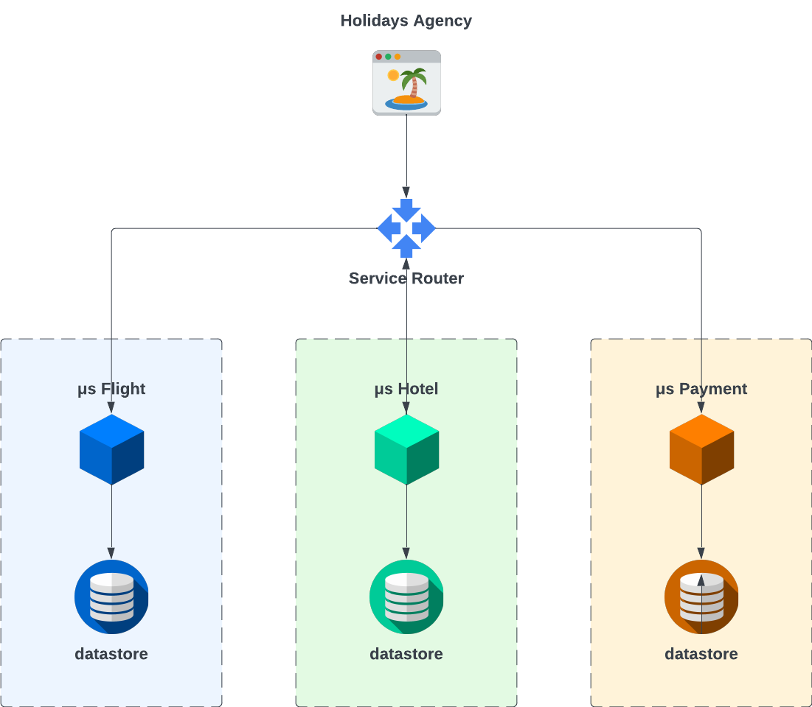

# Redis Saga Patterns
Implementation of the Saga Patterns using Redis

# Brief introduction
Monolith applications have the big advantage of transaction management.
Basically any operation involving one or more changes of the state of the application, it can be considered a local transaction.
That is because the transaction boundary is given only from the application itself.
So, multiple inserts, updates and deletions can be managed easily within the same transaction.

With the adoption of the "new" microservices architectures, each functionality of the monolith application is reduced to a single module, a microservice.
Because of that, each microservice has its own context and transaction boundary.
If previously a function could alter two or more datasets simultaneously within the same transaction, 
now the same functionality is split in different modules, hence different isolated transactions.
However, those transactions can still be managed as one by leveraging a distributed transaction manager, that implements the so-called two-phase commit protocol (aka 2PC).

One of the problems with 2PC architecture is that each transaction participating in the distributed transaction may fail in different manner, aborting the distributed transaction and rolling back the local ones that went fine.
 All or nothing.

Nonetheless, because each microservice is independent, they are potentially implemented using different approaches and architectures, not supporting the distributed transaction manager at all.
Furthermore, the distributed transaction manager may fail and become a single pont of failure of the overall architecture, and mainly a bottleneck.

For the above reasons, with microservices architecture the 2PC is not suitable and new patterns araised, such as the Saga Patterns.

# Saga Patterns
The main principle of the saga patterns is to provide scalability in managing local transactions.
However, I'm not going to give another explanation of what a Saga is, along with its patterns, but I'll just quote what I think is the best description[^1] I found in the internet:

> A saga is a sequence of local transactions. Each local transaction updates the database and publishes a message or event to trigger the next local transaction in the saga. If a local transaction fails because it violates a business rule then the saga executes a series of compensating transactions that undo the changes that were made by the preceding local transactions.
> 
> There are two ways of coordination sagas:
> - Choreography - each local transaction publishes domain events that trigger local transactions in other services
> - Orchestration - an orchestrator (object) tells the participants what local transactions to execute

Having that said (written, copied), let's see how Redis can help to implement those two patterns, in the following business scenario.

A travel agency ecommerce website provides services to book flights, hotels managing also the payments.
Each of these services are implemented as microservice, so with its own context and transaction boundary, as depicted below:

The code is available as branch for each Saga pattern implementation:
- One branch for the Orchestration;
- One branch for the Choreography;

Keep in mind that for the Choreography pattern there will be more than one implementation to show different approaches with different drawbacks and benefits.

[^1] https://microservices.io/patterns/data/saga.html